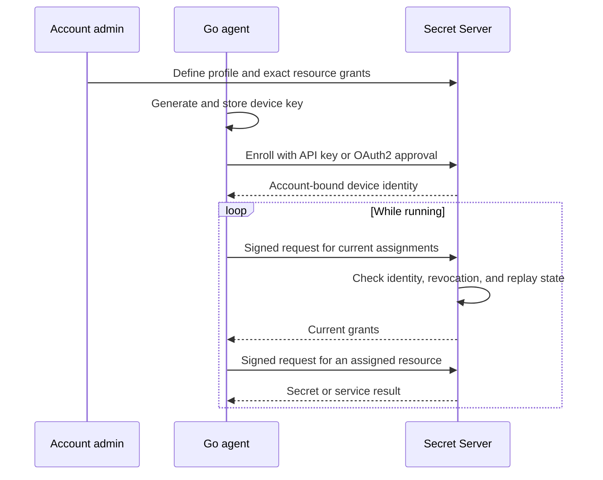

# Secret Server Agent

A Go agent that connects computers to an After Dark Systems Secret Server account
and delivers the secrets and services assigned to each device. A single binary
using only the Go standard library.

This project is part of the After Dark Systems Secret Server platform and is not
affiliated with Delinea Secret Server.

The agent enrolls an Ed25519 device identity into an account using an admin API
key or OAuth2 device authorization. Afterwards, it uses signed device requests;
it does not retain the account API key or OAuth access token. The server checks
account, device, profile, and replay state on every request. HTTPS authenticates
the server and protects the account binding returned during enrollment.

## Capabilities

| Capability | Behavior |
| --- | --- |
| Account login | OAuth2 browser approval or API-key enrollment |
| Device identity | Ed25519 proof of possession on every device request |
| Access assignments | Server-managed profiles with exact resource grants |
| Secret delivery | Private JSON files refreshed automatically |
| Signing | Request signatures from an assigned server-side key |
| Database access | Request credentials from an assigned database role |
| Revocation | Enforced on subsequent requests; failed refreshes clear delivered files |

## How it works



## Requirements

- Go 1.27.1 or newer to build from source.
- A Secret Server API deployment with the matching agent endpoints and database
  migration described under [Server installation](#server-installation).
- An account-admin credential and an enabled access profile in that account.
- HTTPS connectivity to the API. Browser enrollment also needs the approval page.

This is the initial implementation. Publishing this repository does not deploy
its companion server changes. Hardware attestation is not yet implemented.

## Build and enroll

```sh
git clone https://github.com/afterdarksys/secretserver-agent.git
cd secretserver-agent
go build -o bin/secretserver-agent ./cmd/secretserver-agent
# First create an access profile through the account admin API (below).
bin/secretserver-agent login \
  --server https://api.secretserver.io \
  --account ACCOUNT_UUID --profile PROFILE_UUID --name web-01
```

This displays a browser URL, user code, and public-key fingerprint. Open the URL,
sign in as an account admin in another tab if needed, enter the code, compare the
fingerprints, and approve. The OAuth2 device flow follows RFC 8628; its access
token is short-lived, single-use, and scoped only to enrolling that exact key.
Ordinary users and read-only API keys cannot approve or create device profiles.

For unattended enrollment, provision a private file containing an admin API key:

```sh
bin/secretserver-agent login \
  --server https://api.secretserver.io \
  --account ACCOUNT_UUID --profile PROFILE_UUID --name web-01 \
  --api-key-file /secure/enrollment-api-key
```

The source API-key file remains under your control; remove it after successful
provisioning. Revoking this bootstrap API key does not revoke devices already
enrolled with it. Revoke devices explicitly through the device admin API.

The default state directory is `~/.config/secretserver-agent`. Override with
`--state-dir /absolute/path`. Keep its ancestors under trusted ownership. The
identity is saved before network enrollment to avoid losing the generated key.
A completed identity cannot be replaced accidentally by another `login`.
If enrollment fails after the server created a device, inspect the server device
list and revoke that record before removing the pending local identity and
retrying. Never delete a live identity before recording its device ID.

## Assign exact resources

Account admins use bearer-authenticated management endpoints:

| Method | Endpoint | Purpose |
| --- | --- | --- |
| PUT | `/api/v1/agents/profiles/{UUID}` | Create/update profile |
| GET | `/api/v1/agents/profiles` | List profiles and grants |
| POST | `/api/v1/agents/devices` | API-key/OAuth account-token enrollment |
| GET | `/api/v1/agents/devices` | List enrolled devices |
| DELETE | `/api/v1/agents/devices/{UUID}` | Permanently revoke a device |

Example profile request body (substitute real account-owned IDs):

```json
{
  "name": "web-production",
  "enabled": true,
  "grants": [
    {"alias": "app-config", "service": "secret.read", "resource": "SECRET_UUID"},
    {"alias": "release-signing", "service": "key.sign", "backend": "softhsm", "resource": "KEY_HANDLE"},
    {"alias": "database", "service": "database.issue", "resource": "DATABASE_ROLE_UUID"}
  ]
}
```

All resources must already belong to the same account. No wildcard grants.
`key.sign` grants operations on a key; it never downloads private key material.
Set `enabled: false` to disable a profile and all devices assigned to it. Updating
its grants changes device access on the next request without logging in again.
Revocation does not cancel in-flight requests or revoke previously issued database
leases. Existing server lease-revocation APIs handle those separately.

## Use assigned services

```sh
bin/secretserver-agent status
bin/secretserver-agent access --alias app-config
bin/secretserver-agent access --alias database
# sign-request.json: {"message":"BASE64_MESSAGE","purpose":"release"}
bin/secretserver-agent access --alias release-signing --input sign-request.json
# Keep assigned secret.read resources refreshed as private JSON files:
bin/secretserver-agent run --output-dir /absolute/private/secrets --poll 30s
```

`access` deliberately writes the service result, which may contain secrets, to
stdout. Avoid capturing it in logs. `status` prints identity and grant metadata.
The refresh loop includes `secret.read` and `variable.resolve` grants and writes
`<alias>.json` with the secret's data fields, mode 0600,
using atomic per-file replacement. It never automatically issues database leases
or performs signing; applications request those operations explicitly.

The output directory must be empty on first use and mode 0700. Afterwards it is
marked as owned by this device. Treat the whole directory as agent-managed; do
not store other JSON files there. It must not be, contain, or lie inside the
state directory. Delivered aliases that differ only in letter case fail the
refresh, because they would share one file on case-insensitive filesystems. A refresh failure removes delivered files;
401/403 stops the agent. Other failures retry at the polling interval. Each full
refresh is bounded to 30 seconds, so failure detection can take the polling
interval plus 30 seconds. Files are removed on normal shutdown and on restart
before fetching new values. Abrupt termination/power loss can leave files on disk;
use a private tmpfs directory when that matters. Files already opened or copied
by an application cannot be withdrawn. Updates across multiple files are not a
transactional snapshot.

Concurrent writers fail on `.lock`. After an unclean crash, inspect the PID in
that file and verify that the process is gone before removing the lock. No agent
process, service installation, deployment, or live account enrollment is started
by building this repository.

## Security model and current limits

**Current trust level: software device identity.** The private key is an ordinary
0600 file in a 0700 directory. Copying it copies the device identity. Hostname,
MAC address, machine ID, and a key fingerprint are not hardware attestation.
TPM/Secure Enclave key storage and attestation are not implemented. This version
cannot prove that a request originated from one particular physical computer.
A compromised host or root user can read delivered secrets. No offline access,
encrypted persistent cache, local HTTP proxy, or arbitrary remote commands.

## Server installation

Deploy the matching `secretserver.io` changes. Fresh installs include migration
`034_agents.sql`; existing API startup also applies this idempotent migration.
Set `AGENT_VERIFICATION_URI=https://YOUR_WEB_HOST/agent/authorize` for self-hosting.
The default is `https://secretserver.io/agent/authorize`. Deploy the web approval
page with its `NEXT_PUBLIC_API_URL` pointing at the same API.

Use HTTPS with TLS 1.3 and a certificate trusted by the host's system roots.
The agent refuses TLS 1.2 and redirects. TLS termination must preserve the request
path and query exactly. Production must not expose the upstream HTTP listener.
Development allows HTTP only with `--allow-loopback-http` and a literal loopback
IP. That flag is persisted with the identity; it is never a production fallback.

## Running as a service

A Linux systemd unit is provided in
[`deploy/secretserver-agent.service`](deploy/secretserver-agent.service). It uses
a dedicated `secretserver-agent` user, `/var/lib/secretserver-agent` for identity,
and `/run/secretserver-agent` for secret delivery. The unit is an example and is
not installed automatically. Install and enroll as root:

```sh
useradd --system --no-create-home --shell /usr/sbin/nologin secretserver-agent
install -m 0755 bin/secretserver-agent /usr/local/bin/secretserver-agent
install -d -m 0700 -o secretserver-agent -g secretserver-agent /var/lib/secretserver-agent
# The enrollment key must be a 0600 file readable by the service account.
install -d -m 0700 -o secretserver-agent -g secretserver-agent /run/secretserver-agent-enroll
install -m 0600 -o secretserver-agent -g secretserver-agent /secure/enrollment-api-key /run/secretserver-agent-enroll/key
runuser -u secretserver-agent -- /usr/local/bin/secretserver-agent login \
  --server https://api.secretserver.io \
  --account ACCOUNT_UUID --profile PROFILE_UUID --name web-01 \
  --api-key-file /run/secretserver-agent-enroll/key \
  --state-dir /var/lib/secretserver-agent
rm -r /run/secretserver-agent-enroll
install -m 0644 deploy/secretserver-agent.service /etc/systemd/system/
systemctl daemon-reload
systemctl enable --now secretserver-agent
```

For OAuth enrollment, omit `--api-key-file` and the key steps. The unit runs with
no capabilities, a read-only filesystem apart from its state and runtime
directories, and a system-call filter. systemd removes `/run/secretserver-agent`
whenever the service stops, including before an automatic restart. After device
revocation the agent exits with status 1 and systemd retries every 15 seconds;
run `systemctl disable --now secretserver-agent` on a decommissioned host.

## Development and verification

```sh
go test -race ./...
go vet ./...
# From ../secretserver.io; starts disposable PostgreSQL/Vault:
scripts/test-platform-integration.sh
```

The live integration harness lives in the companion server repository and needs
local PostgreSQL and Vault executables. Unit tests in this repository do not
require an account or a running Secret Server.

- [Protocol and design](DESIGN.md)
- [Validation results and untested environments](VALIDATION.md)
- [Report an issue](https://github.com/afterdarksys/secretserver-agent/issues)

When reporting a problem, include the command, Go version, operating system, and
redacted error output. Keep device identities, API keys, and secret values private.

## Named secret variables

Assign a name such as `LOG_SERVER_TX1_S` to a credential field and resolve
`%%LOG_SERVER_TX1_S%%` through the shared server resolver. See the
[variable assignment guide](docs/VARIABLE_ASSIGNMENTS.md) for APIs, SDK methods, Ansible lookup,
Terraform ephemeral templates, CLI rendering, and agent grants.
